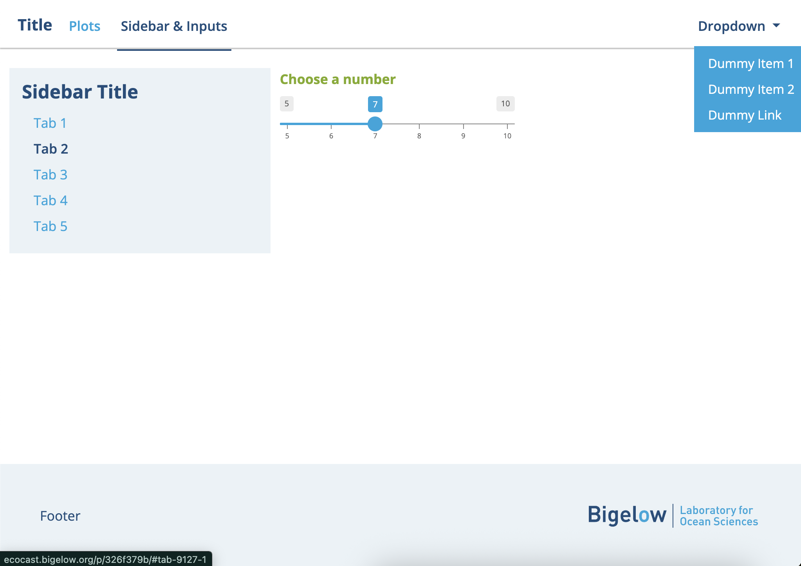

# bigelowshinytheme
This package encompasses a theme object and supporting structure functions for R Shiny apps matching official Bigelow Laboratory styling. 

| Standard Shiny app | Same app with Bigelow styling |
|:---------------:|:--------------------:|
|  |  |

## Demo Application

A demo R Shiny application leveraging Bigelow styling is available to run at [inst/bigelow_shiny_demo/app.R](inst/bigelow_shiny_demo/app.R).

## Basic Usage

Shiny applications draw from the `www/` directory to render styles and images. `bigelowshinytheme::copy_www()` copies a www folder and supporting images to your home directory which are necessary for `bigelowshinytheme` functions.

To add Bigelow theming to your Shiny application, add `theme = bigelowshinytheme::bigelow_theme()` as the first argument to your ui object. To mirror styling to plot objects, call `bigelowshinytheme::bigelow_style_plots()` immediately before your call to `shiny::runApp()` or `shiny::shinyApp()`.

**NOTE: The Bigelow Shiny theme REMOVES default padding on the main body element so that navbars, headers, and footers extend across the page. Use `bigelow_main_body()` or custom styling to add padding for main content.**

## Structural functions

After adding a `bigelow_theme()` object to your code, most Shiny elements are automatically formatted, including navigation bars and UI inputs. If you wish to override a specific style, refer to the [additionalStyles.css](inst/www/additionalStyles.css) file in your copied `www` directory for information on overriding CSS.

The `bigelowshinytheme` package also contains three structural helper functions for essential components of your site.

* `bigelow_header()` renders a header object with a right hand and optional left hand component. It also renders a grey border line underneath. For multi-tab applications, replace `bigelow_header()` with `bslib::navset_bar()`, which will be styled automatically.
* `bigelow_main_body()` is a wrapper for any main body elements (or individual tab panels, for multi-panel sites). It adds simple styling parameters such as padding and max width for readability on large screens.
* `bigelow_footer()` adds a Bigelow-style footer element at the bottom of the screen. It includes customizable right-hand content and the Bigelow logo.

Finally, the `bigelow_card()` function can be used to create a bounding box for plots or charts with distinct header and/or footer elements.

## Code Skeleton

```
library(bigelowshinytheme)
library(shiny)

if (!dir.exists("www")) {copy_www()}

ui <- fluidPage(
  theme = bigelow_theme(), 
  bigelow_header("Header"),
  bigelow_main_body(
    p("Hello World!"),
    bigelow_card(headerContent = "Header for Card", 
                 footerContent = NULL, 
                 plotOutput("plotOutput"))
  ), 
  bigelow_footer("Footer")
)

server <- function(input, output, session) {
  output$plotOutput <- renderPlot({
    plot(iris$Sepal.Length, iris$Sepal.Width, col= iris$Petal.Length)
  })
}

bigelow_style_plots()
shiny::shinyApp(ui, server)
```

